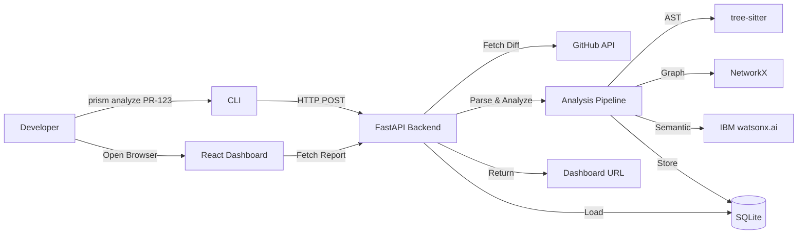

Initialize database"""
    init_db()

@app.get("/")
def root():
    """Health check endpoint"""
    return {
        "service": "PRISM API",
        "status": "running",
        "version": "1.0.0"
    }

@app.get("/health")
def health_check():
    """Detailed health check"""
    return {
        "status": "healthy",
        "database": "connected",
        "timestamp": "2024-01-01T00:00:00Z"
    }
```

---

## Implementation Timeline

### Day 1 (8 hours)
- **Hours 1-2**: Foundation layer (config, db, models, schemas)
- **Hours 3-4**: Utility layer (GitHub client, diff parser, graph serializer)
- **Hours 5-6**: Core services (AST analyzer, graph builder)
- **Hours 7-8**: Core services (impact traverser, risk scorer)

### Day 2 (8 hours)
- **Hours 1-2**: IBM Bob client and regression generator
- **Hours 3-4**: Analysis pipeline orchestration
- **Hours 5-6**: API endpoints and repository layer
- **Hours 7-8**: Testing, debugging, demo preparation

---

## Testing Strategy

### Unit Tests
- Test each service independently with mock data
- Focus on: AST analyzer, graph builder, risk scorer

### Integration Tests
- Test complete pipeline with sample PR
- Verify database persistence
- Test API endpoints

### Demo Preparation
- Create sample repository with known dependencies
- Prepare demo PR with intentional semantic risks
- Pre-run analysis to verify output quality

---

## Key Implementation Notes

### Simplifications for Hackathon
1. **AST Analysis**: Focus on function definitions and imports only
2. **Graph Expansion**: Limited to changed files + immediate neighbors
3. **IBM Bob Integration**: Simple prompt, basic error handling
4. **Database**: SQLite with no migrations (create tables on startup)
5. **Authentication**: No auth required for hackathon

### Production Considerations (Post-Hackathon)
1. Add authentication and authorization
2. Implement webhook integration for automatic analysis
3. Expand AST analysis to cover more code patterns
4. Add caching layer for GitHub API responses
5. Implement async task queue for long-running analyses
6. Add comprehensive logging and monitoring
7. Support multiple programming languages
8. Implement graph persistence and incremental updates

---

## Error Handling Strategy

### Graceful Degradation
- If GitHub API fails: return error with clear message
- If AST parsing fails: skip file, continue with others
- If IBM Bob fails: return graph-only analysis
- If graph building fails: return partial results

### Logging
- Log all API calls with timing
- Log all errors with full context
- Log analysis pipeline progress

### User-Facing Errors
- Clear, actionable error messages
- Suggest remediation steps
- Include support contact information

---

## API Documentation

FastAPI automatically generates interactive API documentation at:
- Swagger UI: `http://localhost:8000/docs`
- ReDoc: `http://localhost:8000/redoc`

---

## Environment Setup

### Required Environment Variables
```bash
# GitHub
GITHUB_TOKEN=ghp_xxxxxxxxxxxxx
GITHUB_API_URL=https://api.github.com

# IBM watsonx.ai
IBM_BOB_API_KEY=your_api_key
IBM_BOB_API_URL=https://us-south.ml.cloud.ibm.com
IBM_BOB_PROJECT_ID=your_project_id
IBM_BOB_MODEL_ID=ibm/granite-13b-chat-v2

# Application
DATABASE_URL=sqlite:///./prism.db
CORS_ORIGINS=["http://localhost:3000"]
LOG_LEVEL=INFO
```

### Running the Backend
```bash
# Install dependencies
pip install -r requirements.txt

# Set environment variables
cp .env.example .env
# Edit .env with your credentials

# Run the server
uvicorn backend.main:app --reload --port 8000
```

---

## Success Criteria

### MVP Complete When:
- [x] CLI can trigger analysis via API
- [x] Backend fetches PR diff from GitHub
- [x] AST analysis extracts code elements
- [x] Dependency graph is constructed
- [x] Impact traversal identifies downstream nodes
- [x] IBM Bob provides semantic insights
- [x] Risk score is calculated
- [x] Regression scenarios are generated
- [x] Report is stored in database
- [x] Dashboard can retrieve and display report

### Demo Ready When:
- [x] Sample PR analysis completes in < 30 seconds
- [x] Dashboard displays all analysis components
- [x] Risk score accurately reflects change impact
- [x] IBM Bob insights are clear and actionable
- [x] No critical bugs in happy path
- [x] Error handling prevents crashes

---

## Next Steps After Planning

1. **Review this plan** with the team
2. **Assign ownership** for each module
3. **Set up development environment** (Python, dependencies)
4. **Create feature branches** for parallel development
5. **Begin implementation** following the phase order
6. **Daily standups** to track progress and blockers
7. **Integration testing** as modules are completed
8. **Demo rehearsal** 4 hours before presentation

---

## Questions to Resolve Before Implementation

1. ✅ IBM Bob API credentials confirmed
2. ✅ GitHub token with appropriate permissions
3. ⚠️ Demo repository URL and sample PR number
4. ⚠️ Frontend dashboard URL for CORS configuration
5. ⚠️ Deployment target (local only or cloud hosting)

---

## Architecture Diagram



---

## Conclusion

This implementation plan provides a clear, actionable roadmap for building the PRISM backend within the hackathon timeline. The architecture is designed for rapid development while maintaining code quality and demonstrability.

**Key Success Factors**:
- Modular design allows parallel development
- Clear interfaces between components
- Graceful degradation ensures demo reliability
- Focus on core value proposition (semantic risk analysis)

**Ready to implement!** 🚀