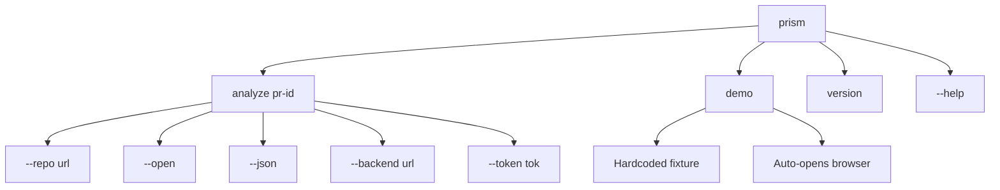

# PRISM CLI Architecture Analysis

**Date:** 2026-05-16  
**Status:** Planning Phase  
**Purpose:** Document current state, identify gaps, and provide implementation roadmap

---

## Executive Summary

The PRISM CLI has a comprehensive architecture plan ([`CLI_PLAN.md`](CLI_PLAN.md)) but the current codebase is in early stages with a **critical architectural mismatch** that must be resolved before implementation.

### Key Finding

- **Architecture Plan:** Typer-based CLI with Rich formatting (traditional command-line interface)
- **Current Code:** Textual-based TUI (interactive terminal user interface)
- **Decision Required:** Choose one approach and align all components

---

## Current State Analysis

### ✅ What Exists

| Component         | Status             | Location                                          |
| ----------------- | ------------------ | ------------------------------------------------- |
| Architecture Plan | ✅ Complete        | [`cli/CLI_PLAN.md`](CLI_PLAN.md) (1068 lines)     |
| Project Structure | ✅ Basic           | [`cli/`](.) directory with skeleton files         |
| Package Config    | ⚠️ Partial         | [`pyproject.toml`](pyproject.toml) (needs update) |
| Main Entry Point  | ⚠️ Wrong Framework | [`main.py`](main.py) (uses Textual, not Typer)    |
| Client Module     | ❌ Empty           | [`client.py`](client.py)                          |
| README            | ❌ Empty           | [`README.md`](README.md)                          |

### ❌ What's Missing

#### Core Implementation Files

- [ ] `cli/config.py` - Settings management with pydantic-settings
- [ ] `cli/formatter.py` - Rich rendering for output
- [ ] `cli/errors.py` - Typed exception hierarchy
- [ ] `cli/demo_fixture.py` - Demo mode constants
- [ ] `cli/utils.py` - Utility functions (exists but empty)

#### Configuration Files

- [ ] `cli/.env.example` - Environment variable template
- [ ] Proper `pyproject.toml` with correct dependencies and entry points

#### Testing Infrastructure

- [ ] `tests/test_main.py` - Command integration tests
- [ ] `tests/test_client.py` - HTTP client tests
- [ ] `tests/test_formatter.py` - Output rendering tests

#### Documentation

- [ ] `cli/README.md` - User-facing documentation
- [ ] API integration contract documentation
- [ ] Development setup guide

---

## Critical Issues

### 🚨 Issue #1: Framework Mismatch

**Current State:**

```python
# cli/main.py (current)
from textual.app import App

class PrismCLI(App):
    def on_mount(self) -> None:
        self.screen.styles.background = "black"
```

**Planned State (per CLI_PLAN.md):**

```python
# cli/main.py (planned)
import typer
from rich.console import Console

app = typer.Typer()

@app.command()
def analyze(pr_id: str, ...):
    # Traditional CLI command
```

**Impact:** These are fundamentally different paradigms:

- **Textual** = Interactive TUI with widgets, screens, and event loops
- **Typer** = Traditional CLI with commands, flags, and stdout

**Recommendation:** Follow [`CLI_PLAN.md`](CLI_PLAN.md) and use **Typer + Rich** because:

1. Simpler for hackathon timeline (300-400 LoC vs 1000+ for TUI)
2. Better for demos (predictable output, easy to script)
3. Matches the documented architecture
4. Easier to test and debug

### 🚨 Issue #2: Dependency Mismatch

**Current [`pyproject.toml`](pyproject.toml:7-11):**

```toml
dependencies = [
    "httpx>=0.28.1",           # ✅ Correct
    "python-dotenv>=1.2.2",    # ⚠️ Should use pydantic-settings
    "textual>=8.2.6",          # ❌ Wrong framework
]
```

**Required (per [`CLI_PLAN.md`](CLI_PLAN.md:982-988)):**

```toml
dependencies = [
    "typer>=0.12",             # CLI framework
    "rich>=13",                # Output formatting
    "httpx>=0.27",             # HTTP client
    "pydantic>=2",             # Data validation
    "pydantic-settings>=2",    # Config management
]
```

**Action Required:** Complete rewrite of dependencies section

### 🚨 Issue #3: Missing Entry Point

**Current:** No console script entry point defined

**Required:**

```toml
[project.scripts]
prism = "cli.main:app"
```

This enables `prism analyze pr-142` after `pip install -e .`

---

## Architecture Validation

### Design Principles (from CLI_PLAN.md)

| Principle                 | Status        | Notes                         |
| ------------------------- | ------------- | ----------------------------- |
| Thin client (300-400 LoC) | ✅ Achievable | Current plan supports this    |
| No analysis logic in CLI  | ✅ Correct    | All logic in backend          |
| Demo reliability first    | ✅ Addressed  | `prism demo` with fixtures    |
| Visual impact             | ✅ Planned    | Rich formatting, color coding |
| Synchronous POST          | ✅ Simple     | No streaming complexity       |

### Command Surface (from CLI_PLAN.md)



**Status:** ✅ Well-defined, ready for implementation

### Data Flow

```
User Input → Config Resolution → HTTP Client → Backend API
                                                    ↓
Dashboard URL ← Rich Formatter ← Response Parser ← JSON Response
```

**Status:** ✅ Clear separation of concerns

---

## Gap Analysis by Component

### 1. Configuration Management

**Planned:** [`cli/config.py`](CLI_PLAN.md:98-103)

```python
class Settings(BaseSettings):
    backend_url: str = "http://localhost:8000"
    github_token: str | None = None
    timeout_seconds: int = 60
    open_browser: bool = False
    output_format: Literal["pretty", "json"] = "pretty"
```

**Current:** ❌ Does not exist

**Priority:** 🔴 High - Required for all commands

### 2. HTTP Client

**Planned:** [`cli/client.py`](CLI_PLAN.md:104-108)

```python
class AnalysisClient:
    def run(pr_identifier, repository_url, github_token) -> AnalysisResponse:
        # POST to backend, validate response
```

**Current:** ❌ Empty file

**Priority:** 🔴 High - Core functionality

### 3. Output Formatting

**Planned:** [`cli/formatter.py`](CLI_PLAN.md:110-114)

- `with_progress()` - Spinner with stage labels
- `render_summary()` - Rich panel with results
- `render_error()` - Styled error messages

**Current:** ❌ Does not exist

**Priority:** 🔴 High - User-facing output

### 4. Error Handling

**Planned:** [`cli/errors.py`](CLI_PLAN.md:115)

```python
class PrismError(Exception):
    hint: str

class BackendUnreachable(PrismError): ...
class BackendTimeout(PrismError): ...
class AuthError(PrismError): ...
```

**Current:** ❌ Does not exist

**Priority:** 🟡 Medium - Improves UX

### 5. Demo Mode

**Planned:** [`cli/demo_fixture.py`](CLI_PLAN.md:117-122)

```python
DEMO_PR_ID = "pr-142"
DEMO_REPO_URL = "https://github.com/prism-demo/payment-service"
```

**Current:** ❌ Does not exist

**Priority:** 🔴 High - Critical for demo reliability

---

## Backend Integration Contract

### API Endpoint

**POST** `{backend_url}/api/analysis/run`

**Request:**

```json
{
  "pr_identifier": "string",
  "repository_url": "string",
  "github_token": "string (optional)"
}
```

**Response (200):**

```json
{
  "report_id": "uuid-string",
  "dashboard_url": "string",
  "risk_score": 0,
  "risk_label": "LOW | MEDIUM | HIGH",
  "impacted_node_count": 0,
  "status": "COMPLETE | PARTIAL"
}
```

**Health Check:**

- **GET** `{backend_url}/healthz` → `{"ok": true}`

**Status:** ✅ Well-defined, needs backend implementation

---

## Implementation Roadmap

### Phase 1: Foundation (Priority 🔴)

1. **Update [`pyproject.toml`](pyproject.toml)**
   - Replace Textual with Typer + Rich
   - Add pydantic and pydantic-settings
   - Add console script entry point
   - Update project metadata

2. **Create [`cli/.env.example`](.env.example)**

   ```env
   PRISM_BACKEND_URL=http://localhost:8000
   PRISM_GITHUB_TOKEN=ghp_your_token_here
   PRISM_REPO_URL=https://github.com/your-org/your-repo
   ```

3. **Rewrite [`cli/main.py`](main.py)**
   - Replace Textual app with Typer commands
   - Implement `analyze`, `demo`, `version` commands
   - Wire up flag parsing

### Phase 2: Core Logic (Priority 🔴)

4. **Create [`cli/config.py`](config.py)**
   - Implement Settings with pydantic-settings
   - Handle .env loading and flag overrides

5. **Create [`cli/errors.py`](errors.py)**
   - Define PrismError hierarchy
   - Add user-friendly hints

6. **Implement [`cli/client.py`](client.py)**
   - AnalysisClient with httpx
   - Request/response handling
   - Timeout and error handling

### Phase 3: User Experience (Priority 🔴)

7. **Create [`cli/formatter.py`](formatter.py)**
   - Progress spinner with stages
   - Summary panel rendering
   - Error formatting

8. **Create [`cli/demo_fixture.py`](demo_fixture.py)**
   - Demo PR constants
   - Wire into demo command

### Phase 4: Documentation (Priority 🟡)

9. **Update [`cli/README.md`](README.md)**
   - Installation instructions
   - Quick start guide
   - Command reference
   - Examples

10. **Create API Contract Doc**
    - Backend integration details
    - Request/response schemas
    - Error handling

### Phase 5: Testing (Priority 🟢)

11. **Create test suite**
    - `tests/test_main.py` - Command tests
    - `tests/test_client.py` - HTTP mocking
    - `tests/test_formatter.py` - Output snapshots

---

## Verification Checklist

After implementation, verify:

- [ ] `pip install -e .` succeeds
- [ ] `prism --help` shows all commands
- [ ] `prism version` prints version
- [ ] `prism analyze pr-142 --repo URL` runs (with mock backend)
- [ ] `prism demo` works with fixture
- [ ] `prism analyze pr-142 --json` outputs JSON
- [ ] Error messages are clear and actionable
- [ ] Browser opens with `--open` flag
- [ ] All tests pass

---

## Recommendations

### Immediate Actions

1. **Decide on Framework** ✅ Recommend: Follow CLI_PLAN.md and use Typer
2. **Update Dependencies** - Align [`pyproject.toml`](pyproject.toml) with plan
3. **Create .env.example** - Document required environment variables
4. **Rewrite main.py** - Replace Textual with Typer

### Documentation Priorities

1. **User-facing:** [`cli/README.md`](README.md) with setup and usage
2. **Developer-facing:** API contract and testing guide
3. **Demo-facing:** Troubleshooting common issues

### Risk Mitigation

1. **Demo Reliability:** Implement `prism demo` first with hardcoded fixture
2. **Error Handling:** Clear error messages with actionable hints
3. **Pre-flight Check:** Health check before long-running analysis
4. **Timeout Handling:** 60s default, configurable

---

## Next Steps

1. ✅ Review this analysis with the team
2. ⏭️ Get approval on Typer vs Textual decision
3. ⏭️ Update [`pyproject.toml`](pyproject.toml) dependencies
4. ⏭️ Create `.env.example` file
5. ⏭️ Begin Phase 1 implementation
6. ⏭️ Update [`README.md`](README.md) with setup instructions

---

## References

- **Architecture Plan:** [`cli/CLI_PLAN.md`](CLI_PLAN.md)
- **Current Code:** [`cli/main.py`](main.py), [`cli/pyproject.toml`](pyproject.toml)
- **Dependencies:** Typer, Rich, httpx, pydantic, pydantic-settings

---

**Document Status:** Draft for Review  
**Last Updated:** 2026-05-16  
**Next Review:** After framework decision
